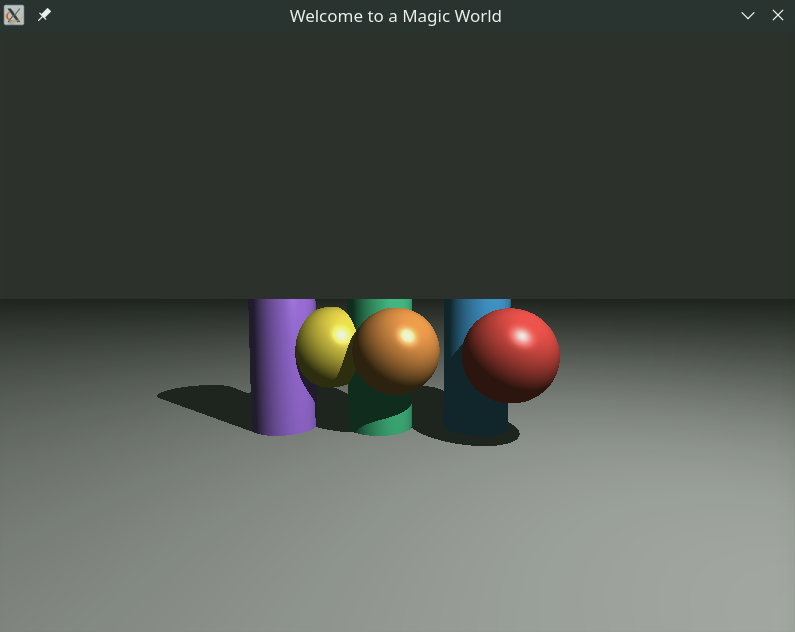

# miniRT

A collaborative ray tracer written in C by glucken and rspinell. It parses scene files and renders spheres, planes, cylinders, and cones with ambient, diffuse, and specular lighting and shadows.

**42 Common Core · Rank 04 · Graphics branch** · [Curriculum hub](https://github.com/Rspinelli93/42-Common-Core)

## Build and render

The checked-in build targets Linux with MiniLibX, X11/Xext development libraries, Make, and a C compiler. A graphical X11 session is required to display the image. MiniLibX sources are included in `minilibx_linux/`.

```bash
git clone https://github.com/Rspinelli93/miniRT.git
cd miniRT
make
./miniRT tests/eval/00_config/valid_minimal.rt
```

Run from the repository root. Scene files define the camera, ambient illumination, light, and geometric objects. More fixtures are grouped in `tests/eval/` for configuration, primitives, transformations, and other rendering cases.

## How it works

The renderer builds a camera basis and sends a ray through each pixel. It solves object intersections, chooses the closest visible hit, and combines ambient, Lambert diffuse, and Phong specular terms with shadow checks.

The implementation supports sphere, plane, cylinder, and cone intersections. This README describes the checked-in implementation; it does not imply that every feature is required by the mandatory subject.

## Credits

Created as part of the 42 curriculum by **glucken and rspinell**. This is a shared project with [G-Lck](https://github.com/G-Lck).



## 📐 Maths

<details>
<summary><strong>Rayon (dir)</strong></summary>

For each pixel `(x, y)`, the code builds one camera ray in world space.

Viewport coordinates are:

$$vpx = \left(2\frac{x + 0.5}{W} - 1\right) \cdot \frac{W}{H} \cdot \tan\left(\frac{fov}{2}\right)$$

$$vpy = \left(1 - 2\frac{y + 0.5}{H}\right) \cdot \tan\left(\frac{fov}{2}\right)$$

Then:

$$\vec d = vpx\,\vec x_{cam} + vpy\,\vec y_{cam} + \vec z_{cam}$$

and `dir = normalize(d)`.

</details>

<details>
<summary><strong>Camera basis (camera_space / create_space)</strong></summary>

The basis is built from camera forward and a world-up helper:

* $\vec z_{cam} = normalize(camera\_vector)$
* choose $\vec u = (0,1,0)$, but if $|\vec z_{cam}\cdot\vec u| > 0.999$, use $\vec u=(0,0,1)$
* $\vec x_{cam} = normalize(\vec z_{cam} \times \vec u)$
* $\vec y_{cam} = normalize(\vec x_{cam} \times \vec z_{cam})$

This avoids degenerate cross products when looking almost straight up/down.

</details>

<details>
<summary><strong>Sphere intersection (distance_sphere)</strong></summary>

Ray equation:

$$P(t)=O+t\vec d$$

With $\vec{oc}=O-C$ and radius $r$, the code evaluates:

$$\Delta=(\vec d\cdot\vec{oc})^2-(\vec d\cdot\vec d)\left((\vec{oc}\cdot\vec{oc})-r^2\right)$$

If $\Delta > 0$:

$$t_{\pm}=\frac{-\vec d\cdot\vec{oc}\pm\sqrt\Delta}{\vec d\cdot\vec d}$$

The chosen hit is the smallest positive $t$.

</details>

<details>
<summary><strong>Plane intersection (distance_plane)</strong></summary>

Plane is point $C$ + normal $\vec n$.

$$t=\frac{\vec n\cdot(C-O)}{\vec n\cdot\vec d}$$

If denominator is near zero (`-1e-6 < denom < 1e-6`), ray is parallel, no hit.

</details>

<details>
<summary><strong>Cylinder intersection (distance_cylinder)</strong></summary>

Let $\vec v$ be cylinder axis (normalized), $\vec{oc}=O-C$, radius $r$.
The implemented quadratic coefficients are:

$$a = \vec d\cdot\vec d - (\vec d\cdot\vec v)^2$$

$$b = 2\left[(\vec d\cdot\vec{oc})-(\vec d\cdot\vec v)(\vec{oc}\cdot\vec v)\right]$$

$$c = \vec{oc}\cdot\vec{oc}-(\vec{oc}\cdot\vec v)^2-r^2$$

For each root $t$, height clipping uses:

$$m=(\vec d\cdot\vec v)t+(\vec{oc}\cdot\vec v)$$

Valid if $0\le m\le h$. Keep smallest valid positive $t$.

</details>

<details>
<summary><strong>Cone intersection (distance_cone)</strong></summary>

The cone is finite and defined by apex $A$, axis $\vec v$ (normalized), diameter $d$, height $h$.

Set:

$$\vec{oc}=O-A, \quad r=\frac{d}{2}, \quad k=\frac{r^2}{h^2}$$

Quadratic coefficients used in code:

$$a = \vec d\cdot\vec d - (1+k)(\vec d\cdot\vec v)^2$$

$$b = 2\left[(\vec d\cdot\vec{oc})-(1+k)(\vec d\cdot\vec v)(\vec{oc}\cdot\vec v)\right]$$

$$c = \vec{oc}\cdot\vec{oc}-(1+k)(\vec{oc}\cdot\vec v)^2$$

After solving, each candidate $t$ is clipped with:

$$m=(\vec{oc}\cdot\vec v) + t(\vec d\cdot\vec v)$$

and accepted only if $0\le m\le h$. We keep the smallest valid positive $t$.

</details>

<details>
<summary><strong>Normals used for lighting</strong></summary>

At hit point $P$:

* Sphere: $\vec n = P-C$
* Plane: $\vec n = \vec v_{plane}$
* Cylinder side:

$$m=(\vec d\cdot\vec v)t + ((O-C)\cdot\vec v)$$

$$\vec n = (P-C)-m\vec v$$

* Cone side:

$$\vec{ap}=P-A, \quad m=\vec{ap}\cdot\vec v, \quad k=\frac{r^2}{h^2}$$

$$\vec n = \vec{ap}-(1+k)m\vec v$$

Normals are then used with angle-based lighting.

</details>

<details>
<summary><strong>Luminosity (ambient + diffuse + specular)</strong></summary>

For each visible object point:

1. Build light ray: $\vec l = L-P$
2. Compute angle $\theta=\angle(\vec n,\vec l)$
3. If $\theta>\pi/2$, use shadow/ambient-only color
4. Else diffuse factor is:

$$deg = \cos(|\theta|)$$

This is exactly Lambert's cosine law: received diffuse light is proportional to
the cosine of the incidence angle between the surface normal and the light
direction.

With normalized vectors, this is equivalent to a dot product:

$$deg = \max(0, \hat n \cdot \hat l)$$

where

$$\hat n = \frac{\vec n}{||\vec n||}, \qquad \hat l = \frac{\vec l}{||\vec l||}$$

Interpretation:

* if light is perpendicular to the surface ($\theta=0$), $\cos\theta=1$ => max diffuse
* if light is grazing ($\theta\approx 90^\circ$), $\cos\theta\approx 0$ => weak diffuse
* if light comes from behind ($\theta>90^\circ$), diffuse is clamped to 0

In this project, the code computes `theta` with `angle_vect(normal, ray)` and
then uses `cos(fabs(theta))`, with the front/back test done before applying
diffuse (`if angle > PI/2 => shadow/ambient only`).

Channel-wise in code:

$$light_r = deg \cdot brightness \cdot L_r/255$$
$$light_g = deg \cdot brightness \cdot L_g/255$$
$$light_b = deg \cdot brightness \cdot L_b/255$$

$$R = R_{obj}\left(A_r\cdot A_{ratio}/255 + light_r\right)$$
$$G = G_{obj}\left(A_g\cdot A_{ratio}/255 + light_g\right)$$
$$B = B_{obj}\left(A_b\cdot A_{ratio}/255 + light_b\right)$$

So diffuse is now explicitly tinted by the light color `(L_r, L_g, L_b)` and scaled by `brightness`.

For specular (Phong), the code computes:

$$\vec l = normalize(L-P), \quad \vec v = normalize(-\vec d)$$
$$\vec r = normalize(2(\vec n\cdot\vec l)\vec n - \vec l)$$
$$spec = (\max(0,\vec r\cdot\vec v))^{48} \cdot brightness \cdot 0.8$$

Then a white highlight is added:

$$R += 255\cdot spec, \quad G += 255\cdot spec, \quad B += 255\cdot spec$$

Then clamp each channel to `[0, 255]`.

</details>

<details>
<summary><strong>Shadows (check_coalition)</strong></summary>

From hit point $P$, cast a shadow ray toward light:

$$\vec d_s = normalize(L-P)$$

An object blocks light if it intersects this ray with distance `t` such that:

$$t > 0.001 \quad \text{and} \quad t < ||L-P||$$

This is checked against spheres, planes, cylinders, and cones. In bonus, the
shadow-ray origin is slightly offset (`P += 0.01 * \vec d_s`) to reduce
self-shadow artifacts (shadow acne).

</details>

